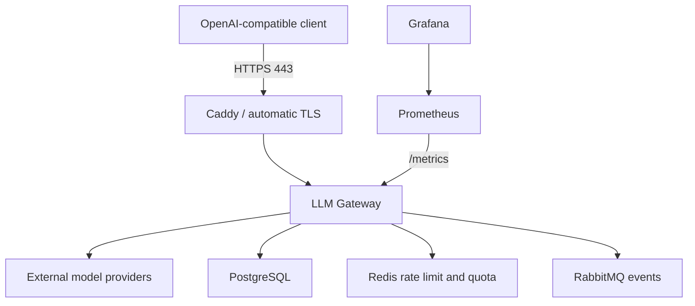

# LLM Gateway 生产部署指南

本文给出一套单机 Linux + Docker Compose 的生产参考部署。它适合第一个正式环境、
内部服务或中等流量场景，但不是跨主机高可用方案。

## 1. 部署拓扑



只有 Caddy 的 80/443 绑定公网。RabbitMQ Management、Prometheus 和 Grafana
仅绑定宿主机 `127.0.0.1`，PostgreSQL、Redis 和 Gateway 不发布宿主机端口。

## 2. 能力边界

这套参考部署具备：

- 自动 HTTPS 和证书续期；
- 独立、单次执行的数据库迁移；
- 文件形式注入 Gateway 密钥；
- readiness 和 liveness 探针；
- 非 root、只读根文件系统、capability 收敛；
- 资源上限和容器日志轮转；
- PostgreSQL、Redis、RabbitMQ、Prometheus 和 Grafana 持久化卷。

它不提供：

- 宿主机故障后的自动切换；
- PostgreSQL、Redis 或 RabbitMQ 跨可用区高可用；
- 自动数据库备份和异地恢复；
- 多 Gateway 实例的服务发现和逐实例 Prometheus 抓取；
- Vault、云 Secret Manager 或 HSM 级别的密钥保护。

关键生产环境应把数据库、Redis 和 RabbitMQ 替换为托管高可用服务，并使用
Kubernetes、ECS、Nomad 等编排平台运行多个 Gateway 副本。

## 3. 前置条件

- 一台受支持的 64 位 Linux 主机；
- Docker Engine 和 Docker Compose `2.24.4+`；
- 一个指向主机公网 IP 的 DNS A/AAAA 记录；
- 防火墙仅向公网开放 SSH、TCP 80、TCP/UDP 443；
- 一个可以拉取 Gateway 镜像的容器 Registry 凭据；
- 至少 4 CPU、8 GiB 内存和足够的持久化磁盘作为起始配置。

Compose 最低版本要求来自生产覆盖文件使用的 `!override` 和 `!reset`，它们用于确保
开发配置中的公网端口和本地构建不会意外残留。

## 4. 构建不可变镜像

生产服务器不应现场构建代码。CI 应基于 Git commit 构建、测试、扫描并推送镜像：

```bash
IMAGE="ghcr.io/henry-1111/llm-gateway:$(git rev-parse --short=12 HEAD)"
docker build --pull -t "$IMAGE" .
docker push "$IMAGE"
```

推荐进一步生成 SBOM、执行漏洞扫描并对镜像签名。部署时使用 commit tag 或 digest，
不要使用 `latest`。

## 5. 配置环境与密钥

```bash
cp .env.production.example .env.production
mkdir -p secrets
chmod 700 secrets
umask 077
```

创建六个密钥文件。示例中的数据库和 RabbitMQ 密码使用十六进制字符，避免 URL
编码歧义：

```bash
openssl rand -hex 32 > secrets/postgres_password.txt
openssl rand -hex 32 > secrets/rabbitmq_password.txt
openssl rand -hex 32 > secrets/grafana_admin_password.txt
printf '%s\n' 'sk-your-real-provider-key' > secrets/provider_api_key.txt
printf '%s\n' 'redis://redis:6379/0' > secrets/redis_url.txt
```

读取生成的 PostgreSQL 和 RabbitMQ 密码，将 `.env.production` 中的
`POSTGRES_PASSWORD`、`RABBITMQ_PASSWORD` 替换为相同值，然后创建连接 URL：

```text
secrets/database_url.txt:
postgresql+asyncpg://gateway:<postgres-password>@postgres:5432/llm_gateway

secrets/rabbitmq_url.txt:
amqp://gateway:<rabbitmq-password>@rabbitmq:5672/
```

最后设置权限：

```bash
chmod 600 .env.production secrets/*.txt
```

编辑 `.env.production`，至少替换：

- `DOMAIN` 和 `ACME_EMAIL`；
- `GATEWAY_IMAGE`；
- PostgreSQL、RabbitMQ 密码；
- Provider 地址、默认模型、限流和额度参数。

Compose 单机模式下的 secrets 本质上仍是宿主机只读文件挂载，不是加密保险库。
云环境应由平台 Secret Manager 挂载或注入这些文件。多 Provider 可以使用
`PROVIDERS_FILE`，内容为现有 `PROVIDERS` JSON 配置，并在部署平台中挂载该文件。

如果使用托管依赖，密钥文件应使用带 TLS 和证书校验的连接地址，例如
`postgresql+asyncpg://...?...`、`rediss://...` 和 `amqps://...`。

## 6. DNS、TLS 与网络

在部署前完成：

1. 将 `DOMAIN` 的 DNS 记录指向主机。
2. 确认公网可以访问 80/443，以便 ACME 完成域名验证。
3. 不向公网开放 3000、5432、6379、9090、15672 或 8000。
4. 若主机使用云安全组，同时检查安全组和系统防火墙。

Caddy 会自动申请并续期证书。生产代理限制请求体为 2 MiB，并隐藏 `/metrics`、
FastAPI 文档和 OpenAPI schema。如果业务需要更大的上下文，请评估内存和滥用风险后
调整 [Caddyfile](../infra/caddy/Caddyfile)。

## 7. 首次部署

先运行无副作用的生产预检：

```bash
./scripts/check-production-env.sh .env.production
```

预检会拒绝：

- 缺失或仍为示例值的必填配置；
- `latest` Gateway 镜像；
- 缺失或空的密钥文件；
- 无法合并的 Compose 配置。

然后执行发布：

```bash
./scripts/deploy-production.sh .env.production
```

发布脚本按以下顺序执行：

1. 拉取全部镜像，拉取失败不会停止现有服务；
2. 启动并等待 PostgreSQL、Redis、RabbitMQ 健康；
3. 运行唯一的 `alembic upgrade head` 迁移任务；
4. 更新 Gateway、监控和 Caddy；
5. 验证 Gateway `/ready`；
6. 输出最终容器状态。

不要在更新时执行 `docker compose down`，否则会制造不必要的停机。

## 8. 初始化租户和验收请求

```bash
docker compose \
  --env-file .env.production \
  -f compose.yaml \
  -f compose.production.yaml \
  exec gateway llm-gateway create-tenant --name 'Production tenant'
```

使用输出的租户 ID 创建 API Key：

```bash
docker compose \
  --env-file .env.production \
  -f compose.yaml \
  -f compose.production.yaml \
  exec gateway llm-gateway create-key \
  --tenant-id '<tenant-id>' \
  --name 'production-client'
```

API Key 明文只显示一次。将它立即存入调用方的 Secret Manager，然后执行真实冒烟：

```bash
curl --fail-with-body "https://gateway.example.com/v1/chat/completions" \
  -H 'Authorization: Bearer <llmgw-api-key>' \
  -H 'Content-Type: application/json' \
  -d '{
    "model": "gpt-4.1-mini",
    "messages": [{"role": "user", "content": "deployment smoke test"}]
  }'
```

同时确认响应包含 `X-Request-ID`、`X-Provider` 和 `X-Provider-Attempts`。

## 9. 健康检查

- `/health`：liveness，只代表进程与 HTTP 事件循环仍能响应；
- `/ready`：readiness，检查 PostgreSQL，以及启用限流或额度时的 Redis；
- `/metrics`：Prometheus 指标，仅允许容器内 Prometheus 访问。

RabbitMQ 不阻断同步 API readiness。请求事件先与业务记录一起写入 Transactional
Outbox；RabbitMQ 恢复后可以继续发布。需要独立告警消费者数量、队列深度、DLQ 和
Outbox 最老 pending 事件年龄。

## 10. 访问内部管理界面

生产覆盖只把管理端口绑定到服务器的 `127.0.0.1`。通过 SSH 隧道访问：

```bash
ssh \
  -L 3000:127.0.0.1:3000 \
  -L 9090:127.0.0.1:9090 \
  -L 15672:127.0.0.1:15672 \
  deploy@gateway-host
```

随后在本机访问 Grafana `http://127.0.0.1:3000`、Prometheus
`http://127.0.0.1:9090` 和 RabbitMQ Management `http://127.0.0.1:15672`。

## 11. 升级流程

每次发布都遵循：

1. 测试、压测、镜像扫描通过；
2. 记录当前镜像 tag/digest；
3. 创建并验证数据库备份；
4. 将 `.env.production` 的 `GATEWAY_IMAGE` 改为新不可变版本；
5. 执行生产预检；
6. 运行发布脚本；
7. 执行带租户 API Key 的真实冒烟；
8. 检查 5xx、P95/P99、Provider 故障转移、Outbox、DLQ 和队列深度；
9. 持续观察一个完整发布窗口。

数据库迁移必须遵守 expand/contract：先增加兼容结构，等所有旧版本退出后，再在后续
版本删除旧结构。这样应用镜像才能安全回滚。

## 12. 备份与恢复

命名 volume 不是备份。至少安排 PostgreSQL 每日备份、异地副本、保留周期和恢复演练。
发布前手动逻辑备份示例：

```bash
mkdir -p backups
docker compose \
  --env-file .env.production \
  -f compose.yaml \
  -f compose.production.yaml \
  exec -T postgres pg_dump -U gateway -Fc llm_gateway \
  > "backups/llm_gateway-$(date -u +%Y%m%dT%H%M%SZ).dump"
```

恢复必须先在隔离环境验证。不要直接覆盖运行中的生产数据库。关键环境推荐使用支持
PITR 的托管 PostgreSQL。Redis 中保存限流和额度状态，需要明确 AOF、复制、故障切换
和额度对账策略；RabbitMQ 需要监控持久化卷、未确认消息和死信队列。

## 13. 应用回滚

Compose 没有事务性回滚。应用回滚步骤是：

1. 将 `GATEWAY_IMAGE` 恢复为上一个已验证 tag/digest；
2. 重新运行预检；
3. 仅更新应用和代理：

```bash
docker compose \
  --env-file .env.production \
  -f compose.yaml \
  -f compose.production.yaml \
  pull gateway
docker compose \
  --env-file .env.production \
  -f compose.yaml \
  -f compose.production.yaml \
  up -d --wait --no-deps gateway caddy
```

默认不要执行 `alembic downgrade`。如果迁移不是向后兼容，只能进入维护窗口，并按已
演练的方案恢复数据库快照或备份。

## 14. 扩容说明

当前 Compose 参考部署以单 Gateway 实例为验收目标。虽然 Outbox 使用
`FOR UPDATE SKIP LOCKED`、消费者支持 competing consumers，多 Gateway 实例仍有两个
工程约束：

- 每个 Gateway 副本都会一起启动 Web、Outbox Publisher 和 Audit Consumer；
- 当前 Prometheus 静态目标不能保证逐实例抓取所有副本。

生产高可用版本应把角色拆分为 Gateway Web、Outbox Worker 和 Audit Consumer，使用
编排平台服务发现与负载均衡，并分别按 HTTP 吞吐、Outbox 积压和队列深度扩容。
优先增加容器副本，不要在单容器内增加 Uvicorn workers；当前 Prometheus Python
指标没有配置多进程聚合。

数据库容量需要满足：

```text
应用副本数 × 每副本进程数 × 每进程最大连接数 < PostgreSQL 可用连接数
```

扩大副本前应配置连接池或 PgBouncer，并重新运行固定参数的 3.5 压力测试。

## 15. 凭据轮换

替换 Provider Key 后，更新 secret 文件并重新创建 Gateway 容器。PostgreSQL、
RabbitMQ 和 Grafana 的初始化密码只在空数据卷首次启动时生效；修改 `.env.production`
或 secret 文件不会自动修改已有账户。必须先在服务内部执行密码修改，再同步连接 secret，
最后滚动重建依赖方。每次只轮换一种凭据，并准备旧凭据的短期回退窗口。

## 16. 常用诊断命令

```bash
# 容器状态
docker compose --env-file .env.production -f compose.yaml -f compose.production.yaml ps

# Gateway 日志
docker compose --env-file .env.production -f compose.yaml -f compose.production.yaml \
  logs --tail=200 gateway

# 迁移版本
docker compose --env-file .env.production -f compose.yaml -f compose.production.yaml \
  exec -T gateway alembic current

# RabbitMQ 队列、积压和消费者
docker compose --env-file .env.production -f compose.yaml -f compose.production.yaml \
  exec -T rabbitmq rabbitmqctl list_queues name messages_ready messages_unacknowledged consumers
```

故障处理时先保存日志和指标证据，再重启服务。不要用 `down -v` 处理故障，它会删除
持久化数据卷。

## 17. 上线验收清单

- [ ] CI 测试和固定参数压力测试通过；
- [ ] 镜像使用不可变 tag/digest，并完成漏洞扫描；
- [ ] `.env.production` 和 secrets 权限为 600，未提交 Git；
- [ ] DNS、证书和防火墙已验证；
- [ ] 只有 80/443 对公网开放；
- [ ] 数据库迁移任务只执行一次；
- [ ] `/health`、`/ready`、真实模型冒烟均通过；
- [ ] Prometheus target 为 up，Grafana 面板有数据；
- [ ] RabbitMQ 主队列消费者大于 0，DLQ 为空；
- [ ] PostgreSQL 备份完成且恢复流程已演练；
- [ ] Provider、PostgreSQL、Redis、RabbitMQ 故障场景已演练；
- [ ] SIGTERM/滚动更新期间在途请求排空已验证；
- [ ] 5xx、延迟、Provider、Outbox、Consumer 和 DLQ 告警已配置；
- [ ] 回滚镜像版本和负责人已记录。
